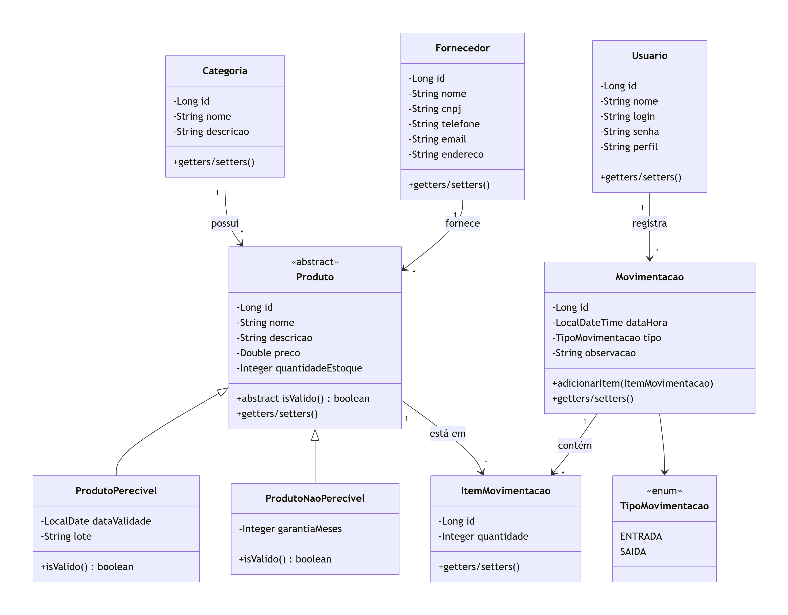
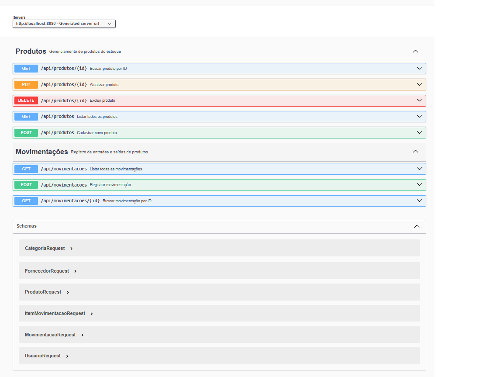

```markdown
# CRUD - Estoque de Produtos

Repositório destinado à entrega do trabalho final na disciplina **"Desenvolvimento de aplicações Java com Spring Boot [26E3_2]"**.

---

## Sobre o Projeto

Este projeto consiste no desenvolvimento de uma **API REST** para o gerenciamento de estoque de um mercantil (comércio varejista de alimentos e produtos diversos). A aplicação permite o controle completo de produtos, categorias, fornecedores, usuários e movimentações (entradas e saídas), com um modelo de dados que reflete as operações típicas de um estabelecimento real.

O desenvolvimento segue uma abordagem evolutiva, dividida em quatro etapas, conforme exigido pela disciplina:

1. **Modelagem orientada a objetos** – definição das classes, relacionamentos, herança e encapsulamento.
2. **Estruturas de dados e serviços** – implementação da lógica de negócio com armazenamento em memória (`Map`).
3. **API REST com Spring Boot** – exposição dos endpoints para manipulação dos recursos.
4. **Persistência com Spring Data JPA** – substituição do armazenamento em memória por banco de dados relacional.

---

## Domínio da Aplicação

### Entidades principais

| Entidade | Descrição |
|----------|-----------|
| **Categoria** | Classifica os produtos (ex.: Bebidas, Limpeza, Padaria). |
| **Fornecedor** | Empresa que abastece o mercantil com produtos. |
| **Produto** (abstrata) | Representa um item genérico, com nome, preço, quantidade em estoque, categoria e fornecedor. |
| **ProdutoPerecivel** | Subclasse de Produto, com data de validade e lote. Possui validação específica (produto vencido não é válido). |
| **ProdutoNaoPerecivel** | Subclasse de Produto, com garantia em meses. Sempre válido. |
| **Usuario** | Operador do sistema, com perfil (ADMIN, OPERADOR) para controle de acesso. |
| **Movimentacao** | Registro de uma entrada ou saída de produtos, contendo data/hora, tipo, usuário responsável e observação. |
| **ItemMovimentacao** | Detalhe de uma movimentação, associando um produto e a quantidade movimentada. |

### Diagrama de Entidades

O diagrama abaixo ilustra o modelo de classes, com todos os relacionamentos e a hierarquia de herança:



### Relacionamentos (1:N)

- Uma `Categoria` pode ter vários `Produtos`.
- Um `Fornecedor` pode fornecer vários `Produtos`.
- Um `Usuario` pode registrar várias `Movimentacoes`.
- Uma `Movimentacao` pode conter vários `ItensMovimentacao`.
- Um `Produto` pode aparecer em vários `ItensMovimentacao`.

---

## Tecnologias Utilizadas

- **Java 21**
- **Spring Boot 3.3.4**
- **Spring Web** (construção da API REST)
- **Spring Data JPA** (persistência de dados)
- **H2 Database** (banco de dados em memória para desenvolvimento/testes)
- **Bean Validation** (validação de dados de entrada)
- **SpringDoc OpenAPI (Swagger UI)** – documentação interativa
- **Maven** – gerenciamento de dependências

---

## Banco de Dados e Persistência (Etapa 4)

### Configuração do H2

A aplicação utiliza o banco de dados H2 em memória, configurado automaticamente. Para acessar o console do H2:

- **URL:** `http://localhost:8080/h2-console`
- **JDBC URL:** `jdbc:h2:mem:estoque_db`
- **Usuário:** `sa`
- **Senha:** (vazio)

### Mapeamento JPA

As entidades foram mapeadas com anotações JPA:

- `@Entity` para classes persistentes.
- `@Id` e `@GeneratedValue` para chaves primárias.
- `@OneToMany` e `@ManyToOne` para relacionamentos.
- Estratégia `InheritanceType.SINGLE_TABLE` para herança de produtos.

Os repositórios estendem `JpaRepository`, fornecendo métodos CRUD prontos e consultas personalizadas.

### Arquitetura atual

```
Cliente HTTP → Controller → Service → Repository → Banco de Dados (H2)
```

---

## Endpoints da API REST

A API está disponível em `http://localhost:8080` e expõe os seguintes recursos:

### Produtos (`/api/produtos`)

| Método | Endpoint | Descrição |
|--------|----------|-----------|
| GET    | `/api/produtos` | Lista todos os produtos (ordenados por nome) |
| GET    | `/api/produtos/validos` | Lista apenas produtos válidos (não vencidos) |
| GET    | `/api/produtos/invalidos` | Lista produtos vencidos |
| GET    | `/api/produtos/estoque-baixo` | Lista produtos com estoque abaixo de um limite (default 10) |
| GET    | `/api/produtos/categoria/{id}` | Filtra produtos por categoria |
| GET    | `/api/produtos/fornecedor/{id}` | Filtra produtos por fornecedor |
| GET    | `/api/produtos/{id}` | Busca um produto pelo ID |
| POST   | `/api/produtos` | Cadastra um novo produto (perecível ou não) |
| PUT    | `/api/produtos/{id}` | Atualiza completamente um produto existente |
| DELETE | `/api/produtos/{id}` | Remove um produto do estoque |

### Movimentações (`/api/movimentacoes`)

| Método | Endpoint | Descrição |
|--------|----------|-----------|
| POST   | `/api/movimentacoes` | Registra uma entrada ou saída de produtos (atualiza o estoque) |
| GET    | `/api/movimentacoes` | Lista todas as movimentações registradas |
| GET    | `/api/movimentacoes/{id}` | Busca uma movimentação pelo ID |

---

## Validação de Dados (Bean Validation)

As requisições são validadas utilizando anotações Bean Validation nos DTOs:

- `@NotBlank` – para campos obrigatórios e não vazios.
- `@NotNull` – para campos que não podem ser nulos.
- `@Size` – para limites de tamanho em strings.
- `@Min` e `@Max` – para valores numéricos.
- `@Positive` – para valores positivos (ex: preço, quantidade).

Quando uma validação falha, a API retorna status `400 Bad Request` com uma mensagem descritiva. Exemplo:

```json
{
  "timestamp": "2026-08-30T21:00:00",
  "mensagem": "Erro de validação: Nome é obrigatório; Categoria é obrigatória",
  "status": 400,
  "path": "/api/produtos"
}
```

### Validações implementadas nos DTOs

- `ProdutoRequest`: nome, preço, quantidade, categoria, fornecedor e flag perecivel são obrigatórios.
- `MovimentacaoRequest`: tipo e usuário são obrigatórios; a lista de itens não pode estar vazia.
- `ItemMovimentacaoRequest`: produto e quantidade são obrigatórios.
- `UsuarioRequest`: id e nome são obrigatórios.
- `CategoriaRequest` e `FornecedorRequest`: campos obrigatórios marcados.

---

## Exemplos de Requisição

### POST `/api/produtos` – Produto não perecível

```json
{
  "nome": "Monitor LED",
  "descricao": "Monitor Full HD 24 polegadas",
  "preco": 899.90,
  "quantidadeEstoque": 50,
  "categoria": {
    "id": 1,
    "nome": "Eletrônicos",
    "descricao": "Produtos eletrônicos"
  },
  "fornecedor": {
    "id": 1,
    "nome": "Distribuidora São Paulo",
    "cnpj": "12.345.678/0001-90",
    "telefone": "(11) 99999-8888",
    "email": "contato@distribuidora.com",
    "endereco": "Rua das Flores, 123"
  },
  "perecivel": false,
  "garantiaMeses": 12
}
```

### POST `/api/movimentacoes` – Entrada de estoque

```json
{
  "tipo": "ENTRADA",
  "usuario": {
    "id": 1,
    "nome": "João Silva",
    "login": "joao.silva",
    "perfil": "OPERADOR"
  },
  "observacao": "Compra inicial",
  "itens": [
    {
      "produto": {
        "id": 1
      },
      "quantidade": 10
    }
  ]
}
```

---

## Documentação Interativa (Swagger UI)

A documentação completa da API está disponível através do **Swagger UI**, que permite visualizar todos os endpoints, testar requisições e ver os schemas dos objetos.

**Acesse:** [http://localhost:8080/swagger-ui.html](http://localhost:8080/swagger-ui.html)



---

## Como Executar o Projeto (Etapa 4 – com JPA/H2)

1. Clone o repositório:
   ```bash
   git clone https://github.com/seu-usuario/CRUD-estoque-de-mercantil.git
   ```

2. Importe o projeto como Maven em sua IDE.

3. Certifique-se de que o banco de dados H2 esteja configurado (já incluso nas propriedades padrão).

4. Execute a classe `EstoqueApplication.java` (Spring Boot). O banco de dados H2 será criado automaticamente em memória.

5. A aplicação iniciará na porta `8080`.

6. Use o **Swagger UI**, **Postman** ou **console H2** para testar os endpoints.

> **Atenção:** O H2 está configurado em memória. Os dados são perdidos ao reiniciar a aplicação. Para ambientes produtivos, recomenda-se usar um banco persistente (PostgreSQL, MySQL, etc.).

### Acessando o console H2

Durante a execução da aplicação, acesse:

- `http://localhost:8080/h2-console`
- **JDBC URL:** `jdbc:h2:mem:estoque_db`
- **User Name:** `sa`
- **Password:** 123

---

## Como Executar as Tags do Git (Etapas anteriores)

Para visualizar ou testar o estado do projeto em cada etapa, utilize as tags criadas no repositório:

**Etapa 1 – Modelagem Orientada a Objetos**
```bash
git checkout etapa-1
```
Neste ponto, o projeto contém apenas as classes de domínio (entidades), com relacionamentos e herança, sem serviços ou API REST. Para ver exemplos de instanciação, utilize o método RUNNER_CASOS_TESTES dentro da classe EstoqueApplication. Para isso, comente a linha SpringApplication.run(EstoqueApplication.class, args); e descomente a chamada RUNNER_CASOS_TESTES(args); no método main. A execução exibirá no console objetos criados para demonstrar o funcionamento das entidades.

**Etapa 2 – Estruturas de Dados e Serviços**
```bash
git checkout etapa-2
```
Aqui já estão implementados os serviços com armazenamento em memória (Map) e as regras de negócio (CRUD de produtos, movimentações, validações). Ainda não há exposição REST. Para testar a lógica, utilize o mesmo procedimento: no main, comente a linha que inicia a aplicação web e descomente RUNNER_CASOS_TESTES(args);. Esse runner executará a rotina ROTINA_PERSISTENCIA_UTILIZANDO_MAP, que popula o estoque, lista produtos, testa entradas e saídas com validações de estoque insuficiente, e exibe os resultados no console.

**Etapa 3 – API REST com Spring Boot**
```bash
git checkout etapa-3
```
A API REST já está exposta, com os controllers e documentação Swagger, mas os dados ainda são armazenados em memória (Map). Para executar, basta rodar a aplicação normalmente – o método main inicia o servidor embutido.

**Etapa 4 – Persistência com JPA (versão atual)**
```bash
git checkout etapa-4
```
Versão final com Spring Data JPA, H2, Bean Validation e todos os recursos implementados.

Para retornar à versão mais recente (geralmente a main ou a etapa mais avançada):
```bash
git checkout main
```

---